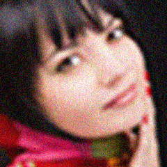
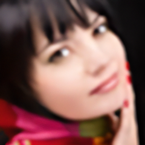

# Image Upscaling with Real-ESRGAN

A Python script to upscale images using the Real-ESRGAN model. This project leverages pre-trained models to enhance image resolution with minimal artifacts.

   

## Features

- Upscale images by 4x using the `RealESRGAN_x4plus` model.
- Supports CPU and GPU (CUDA) processing.
- Configurable tiling to handle large images efficiently.

## Dependencies

- **Python 3.8+**
- Core Libraries:
  - `torch` (PyTorch)
  - `numpy`
  - `Pillow` (PIL fork)
  - `realesrgan`
  - `basicsr`

## Installation

1. **Install PyTorch** (choose the appropriate version for your hardware):
   ```bash
   # For CPU-only:
   pip install torch torchvision --index-url https://download.pytorch.org/whl/cpu

   # For CUDA (GPU):
   pip install torch torchvision --index-url https://download.pytorch.org/whl/cu118
   ```
